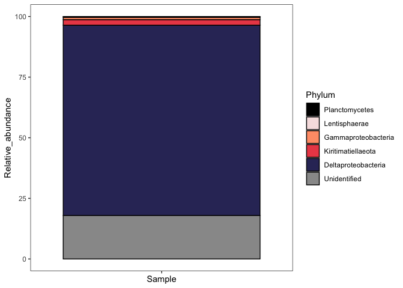
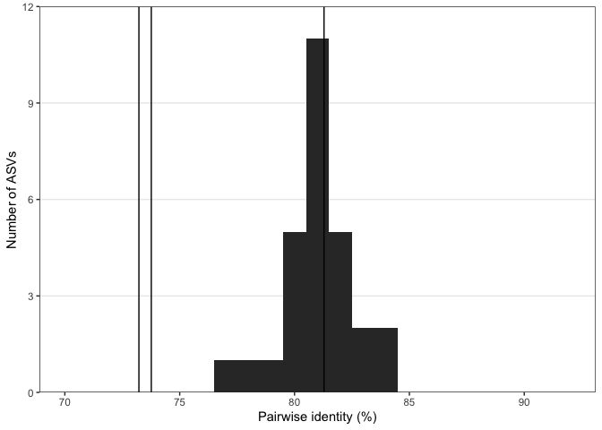
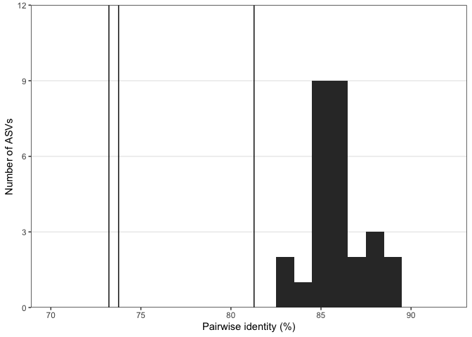

PPIT tutorial (v.1.2.0)
================

|                                                                                                                                                                                                              |
| ------------------------------------------------------------------------------------------------------------------------------------------------------------------------------------------------------------ |
| Phylogenetic Placement for Inferring Taxonomy (PPIT) is an R package for inferring source organism identity of *nifH* sequences. This tutorial reproduces the analyses presented in Kapili & Dekas, in prep. |

## Getting started

To install `ppit` directly from RStudio, use the `devtools` package:

``` r
# install.packages("devtools")
devtools::install_github("BKapili/ppit")
#> Downloading GitHub repo BKapili/ppit@master
#> Skipping 1 packages not available: Biostrings
```

Now, let’s load the `ppit` package to get started.

``` r
library(ppit)
library(phyloseq)
library(Biostrings)
library(ape)
library(ggplot2)
```

In this tutorial, we’ll work with:

  - *nifH* amplicons generated from processing 2x250 paired-end Illumina
    MiSeq reads using dada2
  - SEPP (v.4.3.5) output alignment of reference and query *nifH*
    sequences
  - SEPP output tree of reference and query *nifH* sequences

These data have already been processed as outlined in Kapili & Dekas, in
prep. and are included in the package. For help with the SEPP placement,
see the bonus section at the end of this vignette or the [SEPP
tutorial](https://github.com/smirarab/sepp/blob/master/tutorial/sepp-tutorial.md).

## Optimize operational phylogenetic neighborhood

Here, we’ll optimize the operational phylogenetic neighborhood. This
neighborhood defines the maximum distance between a query and reference
sequence we’ll consider when making host inferences. The actual
parameter that we’re optimizing is the maximum sum of branch lengths
(.., patristic distance) we’ll consider between a query and reference
sequence. Here, we’re defining the optimal value as that which maximizes
the number of inferences returned at the phylum rank.

Note that, while similar in concept, the phylogenetic neighborhood is
different than the rank cutoffs. The primary goal of setting an upper
bound to the sum of branch lengths allowed between a query and reference
sequence is to reduce the number of query sequences mistakenly flagged
for potential horizontal gene transfer. On their own, the patristic
distance rank cutoffs have the tendency to overexplore tree space and
mischaracterize vertical inheritance as horizontal inheritance (see
Kapili & Dekas, in prep.). The value of the operational phylogenetic
neighborhood depends on the query set and can be lower than the
phylum/class/order/family cutoffs, but cannot be lower than the genus
cutoff. This requires that, at minimum, we will use all reference
sequences within the genus cutoff during inferencing. Typically, this
step increases `ppit`’s ability to draw inferences.

To do this, we run the function `tree.partition`, which requires 6
arguments:

  - `type`: specifies whether the query sequences are `partial` (e.g.,
    amplicons) or `full` sequences (e.g., from metagenome-assembled
    genomes). This argument affects how we calculate pairwise percent
    identity (see `?tree.partition` for more details)

  - `query`: vector of the query names for which we want to infer host
    identity

  - `tree`: reference tree with query sequences placed into it

  - `alignment`: reference nucleotide alignment with inserted query
    sequences

  - `taxonomy`: data frame containing the taxonomic and supplementary
    information for the reference sequences

  - `cutoffs`: data frame specifying patristic distance and pairwise
    percent identity taxonomic rank cutoffs

To save time, the optimal phylogenetic neighborhood was previously
calculated (= 0.33). Since it is lower than the genus patristic distance
rank cutoff (= 0.332), we will set it to that value.

``` r
type <- "partial"

ps <- ppit::nifH_example_ps

query <- names(refseq(ps))

tree <- ppit::nifH_example_SEPP_tree

alignment <- ppit::nifH_example_SEPP_alignment

taxonomy <- ppit::nifH_reference_taxonomy_v2

cutoffs <- ppit::nifH_cutoffs_v2

#opt_thresh <- tree.partition(type, query, tree, alignment, taxonomy, cutoffs)
opt_thresh <- cutoffs[1,5]
```

## Infer host identity

Now we’re ready to infer host identities for our sequences\! All we have
to do is run the function `ppit`, which requires the same arguments as
`tree.partition` in addition to the optimal neighborhood value we just
calculated.

``` r
df_inferences <- ppit(type, query, tree, alignment, taxonomy, opt_thresh, cutoffs)
```

Here, we’ll run `ppit` again on the subset of sequences that didn’t have
any references within the optimal phylogenetic neighborhood. We’ll use
the phylum cutoff as the neighborhood. Then, we’ll add the inferences as
the taxonomy table to our phyloseq
object.

``` r
requery <- rownames(df_inferences)[which(df_inferences$Pat_dist_fail == "X")]

df_requery <- ppit(type = type, query = requery, tree = tree, alignment = alignment, taxonomy = taxonomy, opt_thresh = cutoffs[1,1], cutoffs = cutoffs)

df_inferences[match(rownames(df_requery), rownames(df_inferences)),] <- df_requery

tax_table <- as.matrix(df_inferences[match("Domain", colnames(df_inferences)):match("Genus", colnames(df_inferences))])

tax_table[which(df_inferences$Suspected_homolog == "X"),] <- "SUSP_HOMOLOG"
tax_table[which(df_inferences$Percent_id_fail == "X"),] <- "Unidentified"
tax_table[which(df_inferences$Pat_dist_fail == "X"),] <- "Unidentified"
tax_table[which(df_inferences$Potential_HGT == "X"),] <- "Unidentified"

tax_table(ps) <- tax_table
```

### Saving output (optional)

If we want to save our results, we can run this chunk to write the ASV
table and PPIT results data frame to tab-delimited files and the
accompanying sequences to a text
file.

``` r
#write.table(t(otu_table(ps)), file = "FILL_PATH", col.names = TRUE, row.names = TRUE, quote = FALSE, sep = "\t")

#write.table(df_inferences, file = "FILL_PATH", col.names = TRUE, row.names = TRUE, quote = FALSE, sep = "\t")

#write.table(as.data.frame(refseq(ps)), file = "FILL_PATH", col.names = TRUE, row.names = TRUE, quote = FALSE, sep = "\t")
```

## Brief analysis

And that’s all\! Let’s quickly inspect our results. Here, we’ll make a
barplot where we plot the relative abundance of only the *nifH*
sequences from each class from *Proteobacteria* and from each phylum for
all other groups.

``` r
# Subset to just the sample we are interested in.
keep_samps <- c("nifH-mehta-3500-sed-0cm25cm-C2-rep1")
keep_samp_names <- grep(paste(keep_samps, collapse = "|"), sample_names(ps), value = TRUE)
ps_nifH <- subset_samples(ps, sample_names(ps) %in% keep_samp_names)

# Prune any ASVs that are not present in these samples or were identified as suspected homologs.
ps_nifH <- prune_taxa(taxa_sums(ps_nifH) > 0, ps_nifH)
ps_nifH <- subset_taxa(ps_nifH, Phylum !="SUSP_HOMOLOG")

# Convert reads to relative abundances
ps_nifH <- transform_sample_counts(ps_nifH, function(x) x/sum(x))

# Break Proteobacteria into class
tax_table(ps_nifH)[which(tax_table(ps_nifH)[,2] == "Proteobacteria"),2] <- tax_table(ps_nifH)[which(tax_table(ps_nifH)[,2] == "Proteobacteria"),3]

df_ps_nifH <- psmelt(ps_nifH)

# Create a data frame where the abundances are plotted using group abundances and not individual ASVs. Also records the number of ASVs found in each phylum (or class for Proteobacteria) and their avg %id +/- standard deviation.
df_plot <- data.frame(Phylum = unique(df_ps_nifH$Phylum))

# Record total relative abundance for the group.
abundance.sum <- function(tax, df) {
  x <- sum(df[grep(tax, df[,12]), 3])
  
  return(x*100)
}

df_plot$Relative_abundance <- lapply(df_plot$Phylum, abundance.sum, df = df_ps_nifH)

# Record the number of ASVs in the group.
no.asvs <- function(tax, df) {
  x <- length(grep(tax, df$Phylum))
  
  return(x)
}

df_plot$No_ASVs <- lapply(df_plot$Phylum, no.asvs, df = df_ps_nifH)

# Record the average percent identity between the queries and closest references.
avg.id <- function(tax, df_phylo, df_ppit) {
  x <- df_phylo[grep(tax, df_phylo[,12]), 1]
  
  y <- as.numeric(df_ppit[match(x, rownames(df_inferences)), 5])*100
  
  return(paste(mean(y), sd(y), sep = " +/- "))
}

df_plot$Avg_id <- lapply(df_plot$Phylum, avg.id, df_phylo  = df_ps_nifH, df_ppit = df_inferences)

# Reorder the groups to match the order in which we want them to appear in the barchart.
df_plot$Phylum <- factor(df_plot$Phylum, levels = c("Planctomycetes", "Lentisphaerae", "Gammaproteobacteria", "Kiritimatiellaeota", "Deltaproteobacteria", "Unidentified"))

# Add the name of the sample we're analyzing
df_plot$Sample <- "nifH-mehta-3500-sed-0cm25cm-C2-rep1"

ggplot(data = df_plot,
       mapping = aes_string(x = "Sample", y = "Relative_abundance")) +
  
  geom_bar(aes(fill = Phylum), color = "black", stat = "identity") +
  
  scale_fill_manual(values = c("Kiritimatiellaeota" = "#eb4d55",
                               "Lentisphaerae" = "#f6e1e1",
                               "Planctomycetes" = "black",
                               "Deltaproteobacteria" = "#333366",
                               "Gammaproteobacteria" = "#ff9d76",
                               "Unidentified" = "grey60")) +
  theme_bw() +
  theme(axis.text.x = element_blank(),
        panel.grid = element_blank())
```

<!-- -->

Plot up histogram of percent identity for select Desulfuromonadales
ASVs.

``` r
# Read in data frame containing the ASV names of those clustering with G. electrodiphilus, D. kysingii, and the Desulfuromonas metagenomes.
names <- ppit::desulfuro_asvs

# For each column name, corresponding to one of the reference sequences in the Desulfuromonadales, compute the percent identity with each ASV.
for(x in 1:ncol(names)) {
  names[,x] <- unlist(lapply(rownames(names),
       ppit::percent.identity, type = "partial",
       group = colnames(names)[x],
       alignment_as_matrix = as.matrix(ppit::nifH_example_SEPP_alignment)))
}

# Create a new column where, for each ASV, we record the highest percent identity with respect to the Desulfuromonas sequences.
for(x in 1:nrow(names)) {
   names[x,7] <- max(names[x,grep("Desulfuromonas", colnames(names))])
}
colnames(names)[7] <- "Desulfuromonas_max"

# Plot up histogram of percent identities for only those ASVs.
p_geopsychro <- ggplot() +
  geom_histogram(data = names, 
                 aes(x = names[,5]*100),
                 binwidth = 1,
                 fill = "gray20") +
  
  geom_vline(xintercept = nifH_cutoffs_v2[2,3]*100) +
  geom_vline(xintercept = nifH_cutoffs_v2[2,4]*100) +
  geom_vline(xintercept = nifH_cutoffs_v2[2,5]*100) +
  
  theme_bw() +
  
  coord_cartesian(xlim = c(70, 92), ylim = c(0, 12)) +
  scale_y_continuous(expand = c(0,0)) +
  theme(panel.grid.minor = element_blank(),
        panel.grid.major.x = element_blank()) +
  
  labs(x = "Pairwise identity (%)",
       y = "Number of ASVs")

p_desulfuromusa <- ggplot() +
  geom_histogram(data = names, 
                 aes(x = names[,6]*100),
                 binwidth = 1,
                 fill = "gray20") +
  
  geom_vline(xintercept = nifH_cutoffs_v2[2,3]*100) +
  geom_vline(xintercept = nifH_cutoffs_v2[2,4]*100) +
  geom_vline(xintercept = nifH_cutoffs_v2[2,5]*100) +
  
  theme_bw() +
  
  coord_cartesian(xlim = c(70, 92), ylim = c(0, 12)) +
  scale_y_continuous(expand = c(0,0)) +
  theme(panel.grid.minor = element_blank(),
        panel.grid.major.x = element_blank()) +
  
    labs(x = "Pairwise identity (%)",
         y = "Number of ASVs")

p_desulfuromonas <- ggplot() +
  geom_histogram(data = names, 
                 aes(x = names[,7]*100),
                 binwidth = 1,
                 fill = "gray20") +
  
  geom_vline(xintercept = nifH_cutoffs_v2[2,3]*100) +
  geom_vline(xintercept = nifH_cutoffs_v2[2,4]*100) +
  geom_vline(xintercept = nifH_cutoffs_v2[2,5]*100) +
  
  theme_bw() +
  
  coord_cartesian(xlim = c(70, 92), ylim = c(0,12)) +
  scale_y_continuous(expand = c(0,0)) +
  
  theme(panel.grid.minor = element_blank(),
        panel.grid.major.x = element_blank()) +
  
  labs(x = "Pairwise identity (%)",
       y = "Number of ASVs")

p_geopsychro
```

<!-- -->

``` r
p_desulfuromusa
```

<!-- -->

``` r
p_desulfuromonas
```

<!-- -->

## Bonus: Use SEPP to insert nifH ASVs and remove poorly aligned sequences.

For more details about running SEPP, see the [SEPP
tutorial](https://github.com/smirarab/sepp/blob/master/tutorial/sepp-tutorial.md).

``` r
# Insert nifH ASVs into the reference alignment and tree. Before running, make sure there are no "/" characters in any of the sequence names in the files. Also, make sure there are no "--" in any of the sequence fragments, because for some reason SEPP doesn't run for sequences with that in the name

# -t is the input tree (the reference nifH tree; ppit::nifH_reference_tree_v2)
# -r is the RAxML info file (the info file generated during RAxML run; ppit::nifH_reference_RAxML_info_v2)
# -a is the backbone alignment (the reference nifH alignment; ppit::nifH_reference_alignment_v2)
# -f is the fasta file containing sequence fragments (in this case nifH ASVs)

#run_sepp.py -t PATH_TO_REFERENCE_TREE -r PATH_TO_RAXML_INFO_FILE -a PATH_TO_REFERENCE_ALIGNMENT -f PATH_TO_FASTA_FILE

#"INSERT PATH TO guppy PACKAGE" tog --xml output_placement.json
```
